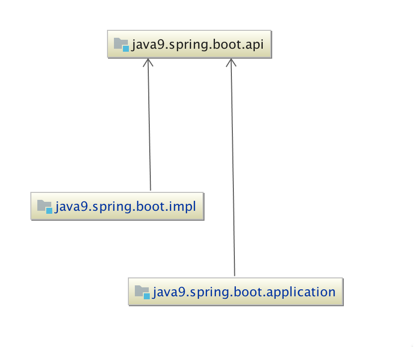

# java9のモジュールにするためにやること
## 参考URL
[Maven JDK9 Jigsaw Example](https://github.com/khmarbaise/jdk9-jlink-jmod-example/tree/master/maven-example)
[A practical guide to Java 9 - compile, jar, run](https://sites.google.com/a/athaydes.com/renato-athaydes/posts/guidetojava9-compilejarrun)

## apiプロジェクト
- [module-info.java](api/src/main/java/module-info.java)作成

## implプロジェクト
- [module-info.java](impl/src/main/java/module-info.java)作成

## applicationプロジェクト
- [module-info.java](application/src/main/java/module-info.java)作成

## runtime-image
runtime image作成用プロジェクト(jlinkプラグイン利用)
※後述

## プロジェクトの依存関係
```
jdeps -s $(find . *.jar)


java9.spring.boot.api -> java.base
java9.spring.boot.impl -> java.base
java9.spring.boot.impl -> java9.spring.boot.api
java9.spring.boot.application -> java.base
java9.spring.boot.application -> java9.spring.boot.api
```



## 実行(従来)
```
clean package
```

```
java -p target/libs -m java9.spring.boot.application/com.hyojinbae.sample.java9.spring.boot.Java9SpringBootApplication
```

## runtime image作成(jlink)
```
clean package
```

```
export JAVA_HOME=`/usr/libexec/java_home -v 9`

$JAVA_HOME/bin/jlink -p $JAVA_HOME/jmods:runtime-image/target/libs --add-modules java9.spring.boot.application \
  --output dist
  
```

### 実行
```
dist/bin/java com.hyojinbae.sample.java9.spring.boot.Java9SpringBootApplication
```

### runtime image作成(特定OS向け)
jlinkはJDKが各OSごとに分かれているのと同様に、特定のOSまたはarchtectureでしか実行できない。

#### MacOSでlinux 64bit用のイメージを作成
##### linux 64bit用のJDKダウンロードして解凍
```
wget --no-check-certificate --no-cookies \
         --header "Cookie: oraclelicense=accept-securebackup-cookie" \
curl -v -j -k -L -H \
         "Cookie: oraclelicense=accept-securebackup-cookie" \
         http://download.oracle.com/otn-pub/java/jdk/9+181/jdk-9_linux-x64_bin.tar.gz \
         > jdk-9_linux-x64_bin.tar.gz
#         http://download.oracle.com/otn-pub/java/jdk/8u131-b11/d54c1d3a095b4ff2b6607d096fa80163/jdk-8u131-linux-x64.rpm
```

```
mkdir jdk9-linux64
tar -zxvf jdk-9_linux-x64_bin.tar.gz -C ./jdk9-linux64

$JAVA_HOME/bin/jlink -p ./jdk9-linux64/jdk-9/jmods:runtime-image/target/libs --add-modules java9.spring.boot.application \
  --output dist
  
```

※ こノーイメージは、macでは実行できない

```
dist/bin/java com.hyojinbae.sample.java9.spring.boot.Java9SpringBootApplication
```

####
terminalにて下記を実行する。

```
docker run -it --rm -v $(pwd)/dist:/dist centos /bin/bash
```

```
dist/bin/java com.hyojinbae.sample.java9.spring.boot.Java9SpringBootApplication
```

### 
## まとめ
- 意図しなかったクラスを参照(import)するのを防げる
- IDE(intellij)機能を使えば簡単にできる


## その他
### jlink
jlinkつーるはautomatic moduleのlinkはサポートしていなめ、automatic moduleが含まれていると下記のエラーが発生する。

```
module-info.class not found for XXX modules
```

そのため、 automatic module(none modular jar)が含まれているアプリケーションのruntime imageを作成するには、module-info.classを作成する必要がある。
その際に、jdepツールの--generate-module-infoオプションが役に立つ。

```
jdeps --generate-module-info dir xxx-1.0.jar xxx.jar
```
