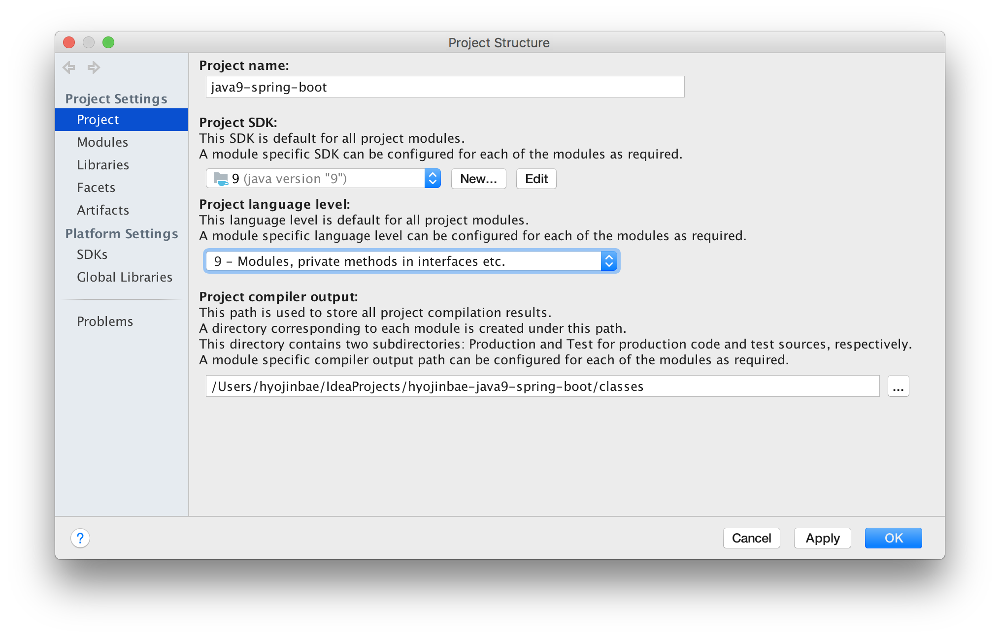

# Java9でspring bootアプリケーションを作ってみる
## 何がしたいか
mavenのmulti projectで作られている従来のspring bootアプリケーションがjava9になると何か変わるが知りたい。

## 前提知識
- spring bootアプリ
- mavenのmulti project機能
- java9のモジュール機能

## プロジェクト構成
- 親プロジェクト
- api
- impl
- application

## やったこと
java9を利用しつつ、java9のモジュール機能を利用しないマルチプロジェクトを作成。

## やること
java9のモジュール機能を利用し、モジュール化してみる。

## 手順
### JDK9 download
### IDE設定

## apiプロジェクト
- [module-info.java](https://github.com/hyojinbae-sample/hyojinbae-java9-spring-boot/blob/use-module/api/src/main/java/module-info.java)作成

## implプロジェクト
- [module-info.java](https://github.com/hyojinbae-sample/hyojinbae-java9-spring-boot/blob/use-module/impl/src/main/java/module-info.java)作成

## applicationプロジェクト
- [module-info.java](https://github.com/hyojinbae-sample/hyojinbae-java9-spring-boot/blob/use-module/application/src/main/java/module-info.java)作成

## Q and A
### Springのコードベースはjava8 source code levelになっているが、module-info.javaのrequiresに指定できる理由は？
https://github.com/spring-projects/spring-framework/wiki/Migrating-to-Spring-Framework-5.x

module pathに通すことで、automatic moduleとして利用できる。

## まとめ
- java9のモジュール機能を利用しない場合、今まで通りに作ればOK。
- java9のモジュールにする場合は、
  - ソースコードの最上位ディレクトリにmodule-info.javaを作成
  - TODO

